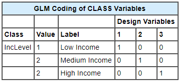

# What Does a CLASS Statement Do?
 The CLASS statement creates a set of design variables (sometimes referred to as dummy variables). They represent the information that's contained in any categorical variables. 
Linear regression is then performed on the design variables. ANOVA can be thought of as linear regression on dummy variables. It's only in the interpretation of the model that 
a distinction is made.   Even if categorical variables are represented by numbers such as 1, 2, 3, the CLASS statement tells SAS to set up design variables to represent the categories. 
If a numerically coded categorical variable were not included in the CLASS variable list, then PROC GLM would interpret it as a continuous variable in the regression calculations.

For CLASS variable coding in PROC GLM, the number of created design variables is the number of levels of the CLASS variable. For example, because the variable IncLevel has three levels,
three design variables are created. Each design variable is a binary indicator of membership in a particular level of the CLASS variable. Each observation in the data set will be assigned 
values on all three of these new variables in PROC GLM.   In this parameterization scheme, however, a third design variable is always redundant when the other two are included. For example,
if you know that IncLevel is not 1 and IncLevel is also not 2, then you don't need a third variable to tell you that IncLevel is 3. Because the design variables are read in order, it's the
third design variable that's considered redundant.   Note:	If you'd like to see the regression equation estimates for the design variables, you can add the SOLUTION option to the MODEL
statement in PROC GLM.
